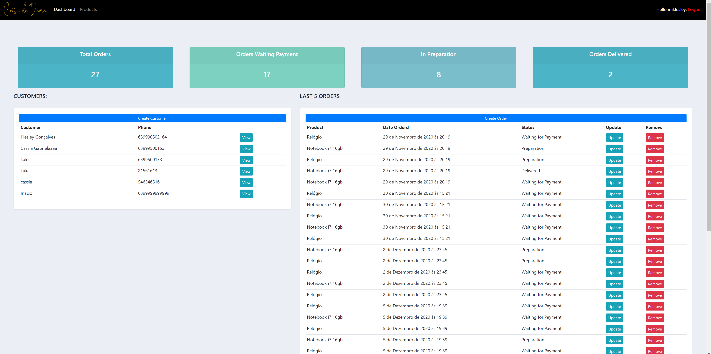

# Customer Relationship Management (CRM) System

This simple CRM system is a web-based application that allows store admins to manage their customer relationships and orders. The main dashboard allows admins to view the number of orders, which orders have been delivered, which orders are awaiting payment, and which orders are in preparation. Additionally, admins can view customer information and access a dashboard where they can create orders, view the customer's prior purchases, and update their customer information. 

## Images



Other images can be found [here](./github/assets/).

## Features

* Login page for admins and customers
* Registration page
* Password recovery
* Main dashboard for store admins
  * View the number of orders
  * View which orders have been delivered
  * View which orders are awaiting payment
  * View which orders are in preparation
* Dashboard for creating orders
* View customer's prior purchases
* Update customer information

## Requirements

* Python version 3.x or higher

## Installation

1. Clone or download the repository
2. Install the requirement packages

```
pip install -r requirements.txt
```

3. Run the migrations

```
python manage.py migrate
```

4. Run the server

```
python manage.py runserver
```

## Usage

1. For admins:
   * Go to the login page and log in with your credentials
   * Access the main dashboard where you can view the number of orders, those that have been delivered, those that are awaiting payment, and those that are in preparation
   * Create orders, view the customer's prior purchases, and update customer information

2. For customers:
   * Go to the login page and log in with your credentials
   * View your prior purchases and update your information.

   
##

<p align="center">Developed by <span color="#007DFF" >Klesley Gonçalves</span></p>
